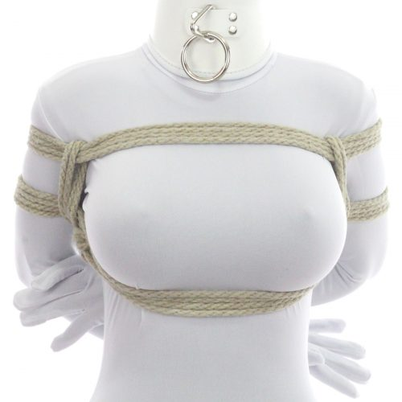
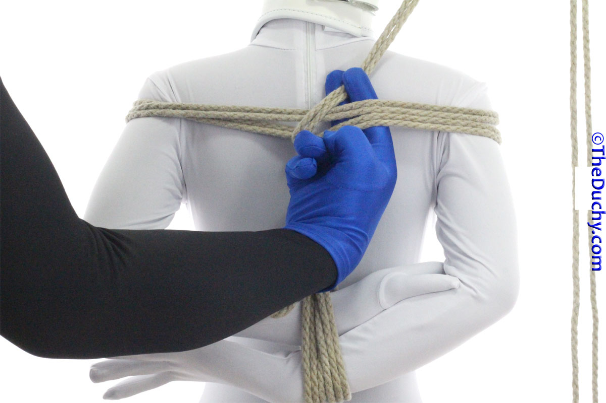
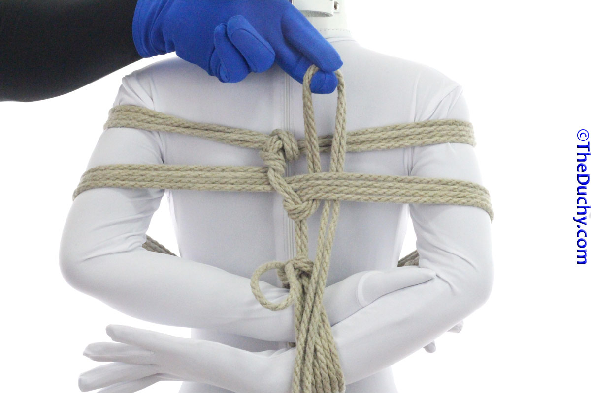
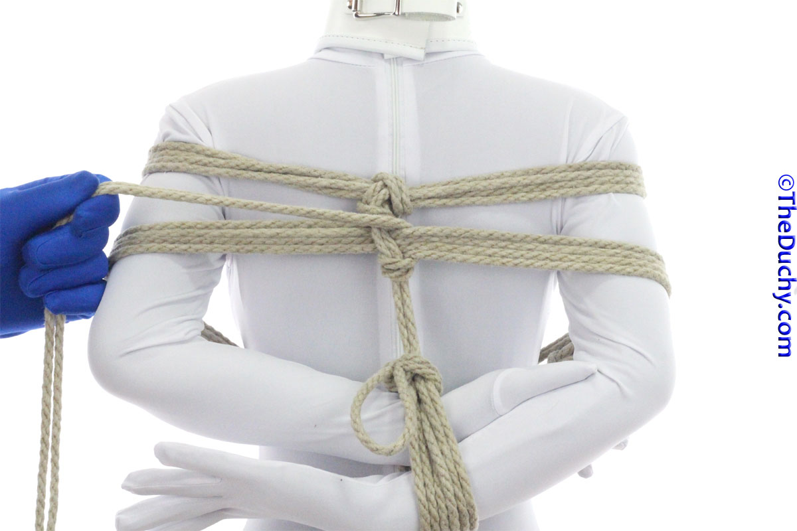
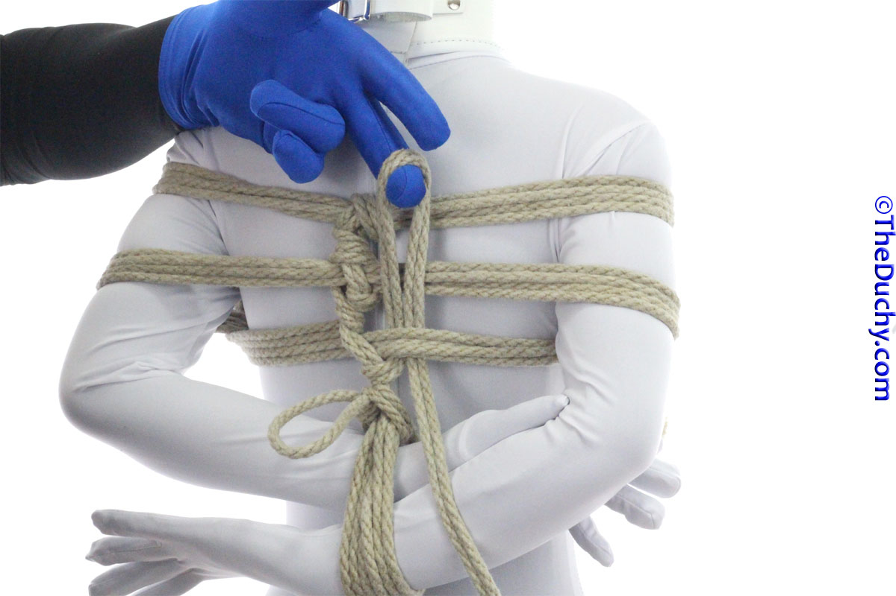
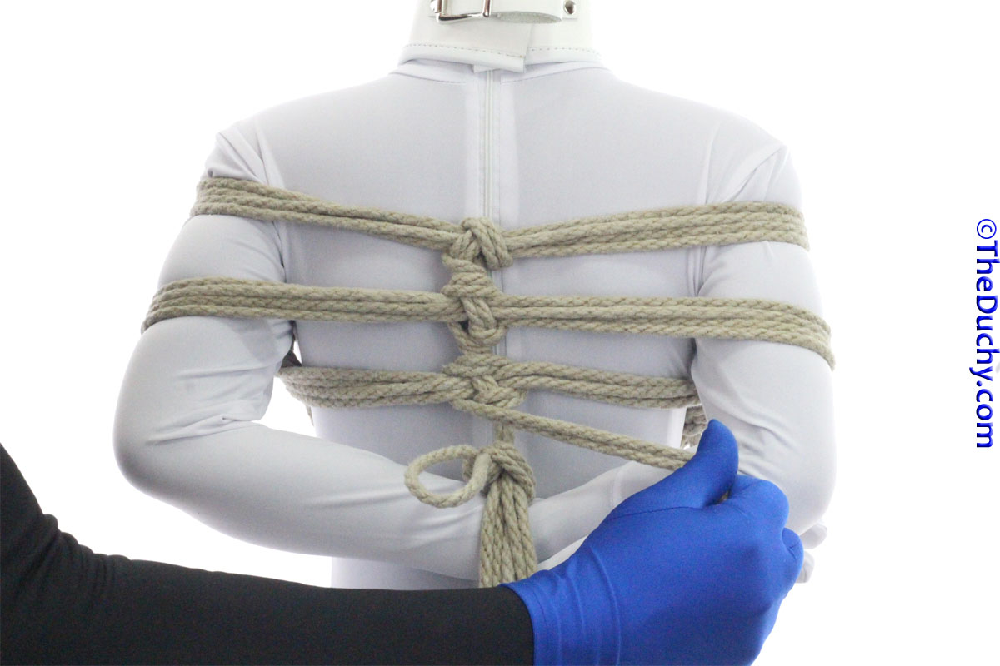
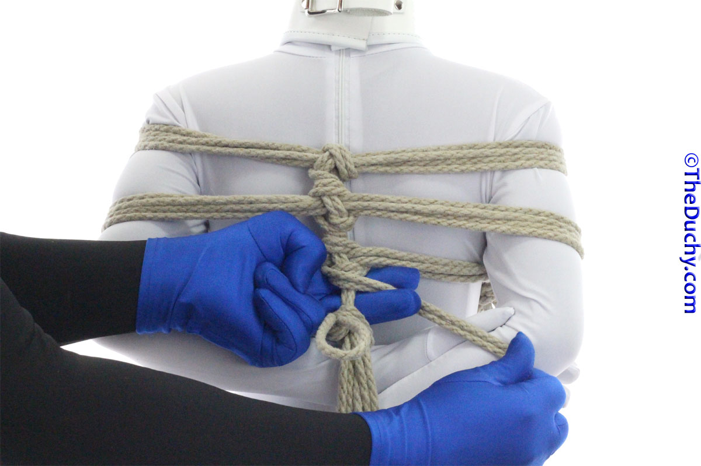

# [2 TK - Gote Shibari - TheDuchy](https://www.theduchy.com/gote-shibari/)

<!-- vim-markdown-toc GFM -->

* [This tutorial shows you how to do 4 different ties that are all built on the same base:](#this-tutorial-shows-you-how-to-do-4-different-ties-that-are-all-built-on-the-same-base)
* [The upper chest strap, secured by an X friction (Includes nerve safety)](#the-upper-chest-strap-secured-by-an-x-friction-includes-nerve-safety)
* [The mid-chest strap, secure with Square Friction or X Friction](#the-mid-chest-strap-secure-with-square-friction-or-x-friction)
* [Option 2 – The Multi-strap Kannuki](#option-2--the-multi-strap-kannuki)

<!-- vim-markdown-toc -->

__This version is fine for floor-level bondage, but do not use it for suspensions__.

This tutorial shows you the basic stylistic techniques for this tie, but does
not cover some very important concepts about even tension and adjusting the
tie for your partner’s body type. Therefore, this version is fine for
floor-level bondage, but do not use it for suspensions.

This is a go-to box tie used by riggers around the world. This tutorial covers
the classic “2-Rope” version that is often the first/basic version that
riggers learn and also covers 3 different common variants for the “3rd-Rope”.
Properly applied, this box tie is very difficult to escape from.

You may have seen this tie and its variants before under the name “Takate
Kote” or “TK”. Technically speaking, the TK is a very specific variant of Gote
Shibari with very specific procedural steps (with certain accepted variants).
This tutorial teaches the same steps and variations that you may have seen
labeled as a TK before, but it does not go over a number of the detailed
technical elements included in the formal “TK”, so this should better be
referred to as “Gote Shibari” — which translates pretty directly as “hands
tied behind the back”.

I point out safety considerations at appropriate points throughout the tutorial
as well. Be sure to read and understand them.

**Warning**: While you often see such box ties used in suspension, **don’t use
this version a for suspension as it places the majority of a person’s weight
on their arms, which can *very* easily cause severe injuries to the radial
nerve** if improperly placed or tensioned, and that damage can take months to
heal. If you want to do suspensions with a box tie, there are far safer
versions that place the load (tension, weight, stress) on the chest, instead
of the arms. These chest-loading versions look almost the same, but their
design makes them more safer for suspension.

**Note:** There are quite a lot of steps in this tutorial, but once you have
have practiced it and the moves are second nature, you can get this on your
partner in 4-5 minutes or even less. I show each step in detail just to try to
explain all the details and nuances.

## This tutorial shows you how to do 4 different ties that are all built on the same base:

- 
- 
- 
- 

## The upper chest strap, secured by an X friction (Includes nerve safety)

-  4. It is easiest to get the rhythm of tying a TK if you set a few rules for yourself. One common one is to always start a new element by going to the left. So, I am going to start wrapping rope around my partner’s shoulders, by first going left :)
-  5. Bring the tail across the middle-lower part of the deltoid. Avoid the valley between the deltoid and the triceps/biceps. The Radial Nerve cluster is in that area and, if pressure is applied there too strongly or for too long, it can make your arm go numb or even result in dangerous nerve damage. If your partner ever says that their hands are going numb, fix it right-effing-now, and look for pressure on this region first. 
-  6. Across the front of the upper chest…
-  7. …and across the deltoid of the other shoulder. Again, be sure to stay at least 1.5″ (4cm) away from where the deltoid meets the triceps
-  8. Bring the tail straight across the back and lay it *on top* of the center line. We will be “wrapping down” to make our straps. Don’t worry about the fact that the center line is diagonal right now, we will straighten it up soon 
-  9. Again across the shoulders and chest, making sure to keep the lines together and parallel, with no twists. Also, try to keep the tension the same during both wraps. One wrap should not be pressing more deeply into the skin than the other
-  4. It is easiest to get the rhythm of tying a TK if you set a few rules for yourself. One common one is to always start a new element by going to the left. So, I am going to start wrapping rope around my partner’s shoulders, by first going left :)
-  5. Bring the tail across the middle-lower part of the deltoid. Avoid the valley between the deltoid and the triceps/biceps. The Radial Nerve cluster is in that area and, if pressure is applied there too strongly or for too long, it can make your arm go numb or even result in dangerous nerve damage. If your partner ever says that their hands are going numb, fix it right-effing-now, and look for pressure on this region first. 
-  6. Across the front of the upper chest…
-  7. …and across the deltoid of the other shoulder. Again, be sure to stay at least 1.5″ (4cm) away from where the deltoid meets the triceps
-  8. Bring the tail straight across the back and lay it *on top* of the center line. We will be “wrapping down” to make our straps. Don’t worry about the fact that the center line is diagonal right now, we will straighten it up soon 
-  9. Again across the shoulders and chest, making sure to keep the lines together and parallel, with no twists. Also, try to keep the tension the same during both wraps. One wrap should not be pressing more deeply into the skin than the other
-  10. Bring the rope to the back
-  11. We will now lock off this strap with an X Friction. Reach under the center line and….
-  12. …pull the tail through
-  13. Run the tail from the lower-left, diagonally to the upper-right.
-  14. This, BTW, is when your partner’s wrists will be raised just a bit. This is why we had them lowered a little in Step 2…
-  15. Reach under the strap from below and grab the tail and pull it down and all the way through
-  16. This time, run the tail from the lower-right to the upper-left…
-  17. And again, reach under the strap from below, grab the tail…
-  18. …and pull it through.. (You can see how the two diagonal wraps form an X.) 
-  19. Run the tail over the center line..
-  20. …and back under…
-  21. …to finish the X Friction. We have completed the upper strap. However there are a few things we need to check before we proceed with the next phase.
-  22. Your Friction is likely not in the middle of your partner’s back at the moment. We can fix that, *and* fix any uneven tension or inadvertently pinched skin at the same time, by…
-  23. Running your fingers under the strap…
-  24. …all the way around your partner…
-  25. …in the opposite direction than the direction you wrapped the rope. You can use that motion to “walk” the rope a little…
-  26. …thus fixing the position of the knot.
-  27. Doing so also gives you the opportunity to adjust the position of the strap to make sure it rests on the deltoid.. Now we can pick up our tail again and move on to Phase 3… 

## The mid-chest strap, secure with Square Friction or X Friction

-  52. Now we begin to create the second strap. You want this one almost exactly in the middle of the arm, right over the middle of the triceps, avoiding that valley between the triceps and deltoid
-  53. So…across the triceps
-  54. And across the middle of the chest. You want the rope to cross at least some part of the sternum, you don’t want it running along the lower ribs; the ribs of the mid chest are much stronger.. If your partner has breasts you want that rope as high under the breasts as you can get it. If you partner does not have breasts, run the rope roughly 1-2″ (2-5cm) below the nipples. 
-  55. Run the rope over the middle of the arm, mid triceps, on the other arm
-  56. Again, taking care to avoid this danger zone
-  57. Bring the tail under the center line
-  58. …and continue on to make a second wrap tightly parallel to the first
-  59. When you run out of rope, just extend it. https://www.theduchy.com/extending-rope/ 
-  60. Try to place the knot as close to the end of the previous rope as you can. But also pay attention to were the knot lands. If it is on a bony part of the body or somewhere were it is not attractive, it is fine to move it. It just so happens in this case that it ends up in a great spot that shouldn’t bother anything :)
-  61. Continue wrapping…
-  62. …and again bring your tail under the center line so that all strand of this strap are together
-  63. You can lock off this band with an X Friction, like we did for the top band, but many people use a Square Friction for this one instead.. Square Frictions are great for very strongly connecting two straps that cross each other as these are doing, and it can be argued that they provide a slightly tighter grip than the X Friction. We will choose the Square Friction:
-  64. Reverse tension around the center line
-  65. Reach under the inline cords from above and grab the tail
-  66. Pull the tail through, then give it a firm tug to ensure that it is tightly compressing the cords in the crossing line
-  67. Lay the tail over top of the center line, above
-  68. Again, pull firmly. The lines in the lower chest strap should deform as they are crushed together. This is what you want. That deformation shows you have it tight enough to have a good, strong grip
-  69. Then, reach under the in-line from below and grab the tail
-  70. Pull the tail through and give it a firm pull to make sure it is tightly griping the center line
-  71. You should see the cords from both bundles of rope being compressed tightly, like this
-  72. Run the tail over the center line again…
-  73. Then reach under the center line…
-  74. …and pull the tail through. This strap is now complete. On to Phase 5!

## Option 2 – The Multi-strap Kannuki

Choose this if you did *not* do the Optional Phase 3 above

-  82. (Option 2) If you want to use the alternate option, run the rope underneath the lower strap (instead of between them)
-  83. Pull the tail to the front
-  84. Lay the tail over top of the lower strap lines, then reach under the upper strap lines from above and grab the tail
-  85. Pull through
-  86. Holding the lines of the strap flat, reverse tension on the tail
-  87. Put a little tension on it, but not too much. The goal is to prevent the upper strap from being able to slid up over the shoulders, you do not want to pull so hard that you start cinching the two straps together
-  88. We now want to run the tail behind the back to the other arm. There are two ways to do this. (1) Reach under the arm from behind and grab the tail, pull it through and then fish it behind the center line to the other arm, or…
-  89. …or, (2) you can grip the tail a little further down and then run the line underneath the arms to the opposite arm in one movement, by running it between the wrists and the small of the back! (fewer tail pulls, faster)
-  90. If you take this second approach, make sure the line of the tail makes it fully behind and past the wrists, up to the middle of the back so that it runs straight from one arm to the other as you can see here (the lowest horizontal line)
-  91. Once on the other side, do your multi-strap Kannuki just as you did before
-  92. Over the lower strap, under the upper strap
-  93. Pull through
-  94. Hold upper strap flat, reverse tension on the tail
-  95. Over the lower strap again…
-  96. …and back to the back
-  97. Pull through. If you plan to do the “Mt Fuji 3TK”, skip the rest of this section and jump to that section 
-  98. And run the tail under the center line so that all line of this Kannuki are on the same side of the center line
-  99. Like this. Now, if you are planning to do a 2TK, continue with this section….. If you plan to do the 3TK or Y-Harness 3TK, skip the rest of this section and jump to one of those sections 
-  100. To lock off the Kannuki for a 2TK, you can use and X Friction or Square Friction. Here I use Square Friction just as we did for the lower chest strap …
-  101. …
-  102. …
-  103. …
-  104. …
-  105. …
-  106. …
-  107. …
-  108. …
-  109. …
-  110. …
-  111. I have quite a bit of rope left over, so I would typically use that up by choosing one of the 3rd rope variants (see below for ideas). But for purposes of showing how to finish the 2TK, I am going to pretend that I only have a few inches left (not enough to go around the waist).. • If I had quite a bit left, I would now do a 3TK • If I only had a few feet (~1-1.5m), I would choose a Y-Harness 3TK. • If I had less than that, but enough to go around my partner’s waist, I would run the rope around the waist then lock off in the back with a half hitch or two 
-  112. All you do if you only have a little rope left is bring that rope up to one of the straps
-  113. Like this
-  114. Then tie it off somewhere up here with a series of half hitches, or by wrapping the rope around the strap lines and then tying it off
-  106. …
-  107. …
-  108. …
-  109. …
-  110. …
-  111. I have quite a bit of rope left over, so I would typically use that up by choosing one of the 3rd rope variants (see below for ideas). But for purposes of showing how to finish the 2TK, I am going to pretend that I only have a few inches left (not enough to go around the waist).. • If I had quite a bit left, I would now do a 3TK • If I only had a few feet (~1-1.5m), I would choose a Y-Harness 3TK. • If I had less than that, but enough to go around my partner’s waist, I would run the rope around the waist then lock off in the back with a half hitch or two 
-  112. All you do if you only have a little rope left is bring that rope up to one of the straps
-  113. Like this
-  114. Then tie it off somewhere up here with a series of half hitches, or by wrapping the rope around the strap lines and then tying it off

